# JobFlow -  MERN Job Portal


**JobFlow** is a modern, high-performance job board application built with the **MERN Stack** (MongoDB, Express, React, Node.js). It features a stunning **Dark Glassmorphism UI**, secure authentication, and a seamless user experience for both job seekers and employers.

## 🚀 Features

- **🎨 Modern Dark Glass UI**: A premium, futuristic interface with glassmorphism effects, neon glows, and smooth animations using Tailwind CSS.
- **🔐 Secure Authentication**: JWT-based authentication with secure login and registration for Job Seekers and Employers.
- **💼 Job Management**:
  - **Browse Jobs**: Interactive job board with rich job cards.
  - **Post Jobs**: Easy-to-use job posting interface.
- **🏢 Company Insights**: Dedicated section to explore top companies hiring now.
- **💰 Salary Intelligence**: Data-driven salary insights by role and location.
- **👤 User Profiles**: comprehensive profile management with photo upload capabilities.
- **📱 Fully Responsive**: Optimized for mobile, tablet, and desktop devices.

## 🛠️ Tech Stack

### Frontend
- **Framework**: React.js (Vite)
- **Styling**: Tailwind CSS (v4), PostCSS
- **Icons**: Lucide React
- **Routing**: React Router DOM v6
- **HTTP Client**: Axios

### Backend
- **Runtime**: Node.js
- **Framework**: Express.js
- **Database**: MongoDB (Mongoose ODM)
- **Authentication**: JSON Web Tokens (JWT), Bcrypt.js
- **File Handling**: Multer

## 🏗️ Architecture

A simplified view of how data flows through the **JobFlow** application:

```mermaid
graph LR
    User[👤 User] -->|HTTPS Request| React[⚛️ React Client]
    React -->|REST API Calls| Node[🟢 Node/Express API]
    Node -->|Queries/Updates| Mongo[🍃 MongoDB Database]
    Mongo -->|Data| Node
    Node -->|JSON Response| React
    React -->|Render UI| User
```



## 🔍 Filter System Logic

Our backend implements a robust filtering system to help users find the perfect job. Here's a glimpse of the logic used in our `getJobs` controller:

```javascript
// server/controllers/jobController.js

exports.getJobs = async (req, res) => {
    try {
        const { search, type, location, salary } = req.query; // Destructure query params
        let query = {};

        // 1. Search by Job Title (Case-Insensitive Regex)
        if (search) {
            query.title = { $regex: search, $options: 'i' };
        }

        // 2. Filter by Job Type (Full-time, Part-time, etc.)
        if (type) {
            query.type = type;
        }

        // 3. Filter by Location (City/Remote)
        if (location) {
             query.location = { $regex: location, $options: 'i' };
        }

        // 4. Execute Query & Populate Company Data
        const jobs = await Job.find(query)
            .populate('postedBy', 'name profilePhoto')
            .sort({ createdAt: -1 }); // Newest first

        res.json(jobs);
    } catch (err) {
        // Error handling...
    }
};
```

## 💡 Challenges Faced & Solutions

During development, we encountered several interesting technical challenges:

### 1. Handling Duplicate Job Applications
**Challenge**: Users could accidentally spam the "Apply" button, sending multiple requests for the same job.
**Solution**: We implemented a check in the backend to verify if a user has already applied for a specific job before creating a new application record.

```javascript
const existingApplication = await Application.findOne({
    job: req.params.id,
    applicant: req.user.id
});

if (existingApplication) {
    return res.status(400).json({ message: 'Already applied for this job' });
}
```

### 2. Secure Resume Uploads
**Challenge**: allowing users to upload resumes while preventing malicious file uploads.
**Solution**: integrated `Multer` with strict file type validation (PDF, DOC,DOCX only) to ensure only safe documents are stored on the server.

## 📦 Installation & Setup

Follow these steps to set up the project locally.

### Prerequisites
- Node.js (v14 or higher)
- MongoDB (Local or Atlas URI)
- Git

### 1. Clone the Repository
```bash
git clone https://github.com/yourusername/job-portal.git
cd job-portal
```

### 2. Backend Setup
Navigate to the server directory and install dependencies:
```bash
cd server
npm install
```

Create a `.env` file in the `server` directory:
```env
PORT=5001
MONGO_URI=your_mongodb_connection_string
JWT_SECRET=your_jwt_secret_key
CLIENT_URL=http://localhost:5173
```

Start the backend server:
```bash
npm start
```

### 3. Frontend Setup
Open a new terminal, navigate to the client directory, and install dependencies:
```bash
cd client
npm install
```

Create a `.env` file in the `client` directory (optional if using defaults):
```env
VITE_API_URL=http://localhost:5001/api
```

Start the React development server:
```bash
npm run dev
```

## 📂 Project Structure

```
Job Portal/
├── client/                 # React Frontend
│   ├── src/
│   │   ├── components/     # Reusable UI components (Navbar, etc.)
│   │   ├── pages/          # Page components (Home, Jobs, Profile, etc.)
│   │   ├── services/       # API integration service
│   │   ├── App.jsx         # Main App component with Routes
│   │   └── index.css       # Global styles (Tailwind imports)
│   └── ...
├── server/                 # Node.js Backend
│   ├── controllers/        # Request handlers
│   ├── models/             # Mongoose schemas
│   ├── routes/             # API route definitions
│   ├── middleware/         # Auth & Error handling middleware
│   └── server.js           # Server entry point
└── README.md               # Project Documentation
```

## 🤝 Contributing
Contributions are welcome! Please feel free to submit a Pull Request.

1. Fork the project
2. Create your feature branch (`git checkout -b feature/AmazingFeature`)
3. Commit your changes (`git commit -m 'Add some AmazingFeature'`)
4. Push to the branch (`git push origin feature/AmazingFeature`)
5. Open a Pull Request

## 📄 License
This project is licensed under the MIT License - see the [LICENSE](LICENSE) file for details.
